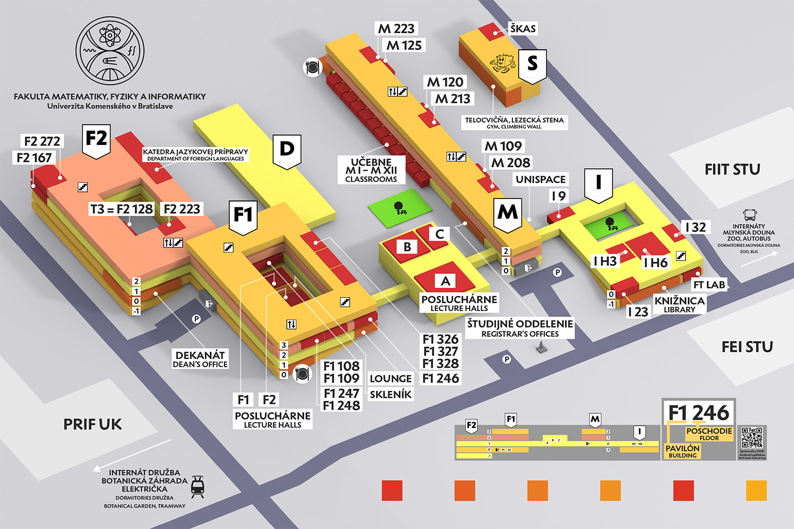

+++
title = 'Užitočné informácie'
date = 2026-06-08T00:00:00+01:00
draft = false
summary = 'Orientácia na fakulte, jedálne, knižnica, načo ti je ISIC...'
weight = 5
+++

Študentská komora akademického senátu (ŠKAS) každoročne vydáva [Matfyzákovho sprievodcu po galaxii](https://prvaci.matfyzjein.sk/sprievodca_prvaci_2025.pdf), kde nájdeš dôležité informácie, ktoré budeš potrebovať pred začiatkom štúdia aj počas prvých týždňov na fakulte.



- *dekanát a pavilón F1* (hlavný vchod, Mlynská dolina) -- sekretariát dekana, dekanát, fyzikálne katedry, posluchárne F1, F2
- *pavilón matematiky (M)*: **študijné oddelenie**, matematické a informatické katedry, na chodbe do pavilónu F1 sú posluchárne A, B, C
- *pavilón informatiky (I)*: fakultná knižnica na -1. poschodí (vchod cez pavilón M)
- *pavilón športu (S)*: telocvične, posilňovňa, lezecká stena









ISIC je kombinovaný preukaz študenta: slúži na preukázanie statusu študenta (často uznávaný aj v zahraničí), knižničný preukaz, dopravná karta a používa sa aj na uplatnenie zliav v študentských jedálňach. Zároveň je potrebný na využívanie mnohých študentských zliav na Slovensku aj v zahraničí, napríklad v obchodoch, kinách, múzeách, pri cestovaní, ubytovaní či na rôzne softvérové a online služby (pozri [isic.sk](https://isic.sk)).

ISIC je však potrebné si po zápise aktivovať. Viac informácii o aktivácii preukazu a o zľavách na dopravu nájdeš v návode [Zápís; Aktivácia ISIC-u](../zapis/isic).




- *bufet FreeFOOD*: pavilón matematiky, na konci chodby,
- *jedáleň FaynFOOD*: pavilón fyziky, pri fyzikálnom vchode,
- *v blízkosti*: jedáleň v areáli internátov Mlyny Eat&Meet, jedáleň na PriF UK, jedáleň v areáli internátov Družba.

Aktuálne jedálne lístky nájdeš na [tejto
stránke](https://zona.fmph.uniba.sk/sluzby-a-administrativa/jedalne-listky/).





Fakultná knižnica *KEC* (Knižnično-edičné centrum) sa nachádza na -1. poschodí pavilónu I, vchod cez pavilón matematiky. Každý študent UK je pri zápise automaticky do knižnice zaregistrovaný, žiadny ďalší registračný formulár nie je potrebný a registrácia je bezplatná.

Preukazom čitateľa je tvoj ISIC. Do online katalógu ([alis.uniba.sk](https://alis.uniba.sk)) a čitateľského konta sa prihlasuj číslom čipu (SNR) z ISIC preukazu, čo je zároveň číslo konta aj predvolené heslo. V tomto portáli si môžeš knihy zarezervovať a aj predlžovať výpožičku (max. raz). Pokuta za oneskorené vrátenie je 0,50 €/knihu/deň.

Ďalšie informácie napríklad o tom, ako prebieha výpožička knihy online alebo osobne nájdeš vo videu [Knižnica FMFI UK](https://www.youtube.com/watch?v=7h3Kg0KofuQ).

